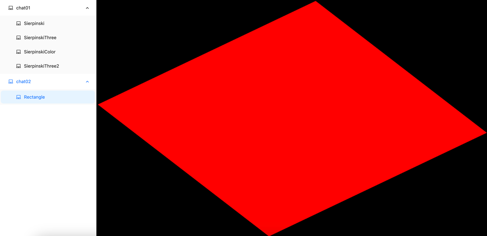

# webgl-react-vite学习笔记

## 项目运行
```javascript
npm i
npm run dev
```

## 目录
- [chat01](#chat01)
    - [Sierpinski]()
    - [SierpinskiThree]()
    - [SierpinskiColor]()
    - [SierpinskiThree2]()

- [chat02](#chat02)
    - [Rectangle]()


## chat01
- Sierpinski

- SierpinskiThree
- 
- SierpinskiColor

- SierpinskiThree2

## chat02
- Rectangle

